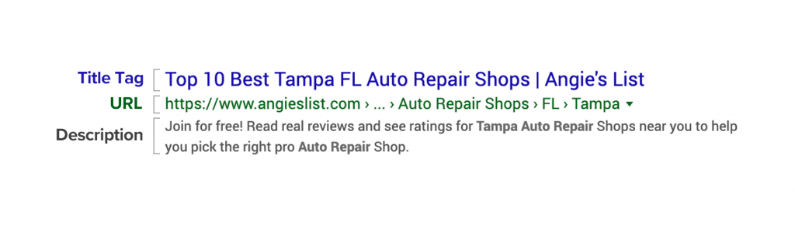

# Exploring HTML and CSS
## Building a modern site using only HTML and CSS

I am building this project to expand my knowledge of HTML and CSS and to fortify
the knowledge I already have. This project will be an excellent viewing ground
for anyone who wants to see my HTML and CSS chops. My hope is to use every type
of HTML tag that does not involve scripts, so I can have an in depth understanding
of each tag. Eventually, I would like to explore each type of attribute associated
with those tags, including accessibility-related tags such as WAI-ARIA, and other
metadata related tags in the head of the document.

Likewise, I want to explore all the available CSS styles, and utilize best
practices such as a mobile-first design approach, inlining important CSS styles
to prevent CSS blocking in the Critical Path when rendering in a browser, moving
away from media queries for responsiveness, accessibility, and many more.

I will also provide some level of documentation in this project, so my examples
can help budding new developers understand what I did and why I did it, should
they ever come across my page, and more seasonsed developers to notice the
thoroughness of this project.

Thank you for joining me in this journey. Let us begin.

---

## How to use this repository

This repository will include commits for every new tag I showcase and new styling
technique I want to show off. You can read the commits for more information.
Alternatively, I will be updating the README periodically to showcase the different
pieces I include. Likewise, this site will include branches with any deprecated
or unused tags or styles, so be sure to look at those if interested.

---

## HTML
### Head
#### Meta Tags and Title
**`content-type`**

This metadata declares the MIME type and character encoding of the document.

1. **The MIME type** (`text/html`) is primarily used when loading the webpage
   locally, so the browser is aware of what type of file it will be parsing. It
   is not necessary when loaded through HTTP, since there is a `Content-Type`
   heading in the HTTP request. In this case, we are defining the MIME type as a
   text file written in HTML.

2. **The character encoding** (`charset=UTF-8`) instructs the browser on what
   character encoding is used for this page. This is important because it
   overwrites the platform default encoding which could lead to disasterous
   results for your site. In our case, we want the character set to be
   [UTF-8 (external link)](https://blog.hubspot.com/website/what-is-utf-8).

**`viewport`**

This metadata sets allows for websites to be mobile responsive by sizing the
`viewport`, the visible area of a webpage on a display device. It containse two
specific properties: `width` and `initial-scale`.

1. **`width`** controls the size of the `viewport`. When defined as
   `device-width` as we have done in this project, the `width` of the `viewport`
   will be the `width` of the device.

2. **`initial-scale`** controls the zoom level when the page is first loaded.
   When `initial-scale=1.0`, we are ensuring the zoom level is maintained when
   orientation is changed, and the zoom level is not too zoomed in or too zoomed
   out on the site after load.

**`title`**

The `title` shows up as the header of any search result as depicted in the image
below. The `title` is also used by search engines for searches, so it is important
to keep the `title` concise and relevant to the page for maximum results.

**`author`**

The `author` is not a necessary metadata for SEO or any pertinent function. I
simply include it in my files for pride's sake.

**`description`**

The `description` metadata shows up as the description in a search result
depicted in the image below. It ought to describe the page, ideally selling to
the user why they should enter your page. It is not used in SEO, but it is shown
when searching as seen below.

**`keywords`**

Most search engines do not use the `keywords` metadata when running a search;
however, there is always a slim chance that the `keywords` defined can assist in
searches. It is not necessary to include, but if it is included, it should list
relevant keywords.

#### Links **`<link rel="" href="">`**

HTML External Resource Links (Links) are used to specify the relationship between
a current HTML document and the resource linked in the `href`. The `link` tag
includes a `rel` (relationship) attribute, an attribute to specify what the
relationship between the current HTML document and the linked document/file, and
an `href` attribute, an attribute that provides the path to the resource being
linked. Links are often associated with `stylesheet` relationships, but they can
also be used for favicons and other resources. Links contain other attributes,
but the two most important are `rel` and `href`.

## CSS
### CSS Reset

A CSS Reset is a CSS file that targets styles that are normally different in
different browsers. A CSS Reset ensures that all browsers have a common starting
point by targeting specific styles that are explicitly different from the styles
of another browser. [`sanitize.css`](https://csstools.github.io/sanitize.css/)
is my choice of CSS Reset. I prefer `sanitize.css` because it is more opinionated
and separates the styles it *sanitizes* with a separate typography and a separate
form stylesheet. Another favorite is the less opinionated
[`normalize.css`](https://csstools.github.io/normalize.css/) which `sanitize.css`
is developed over. Therefore, `sanitize.css` is effectively a superset of
`normalize.css`.
